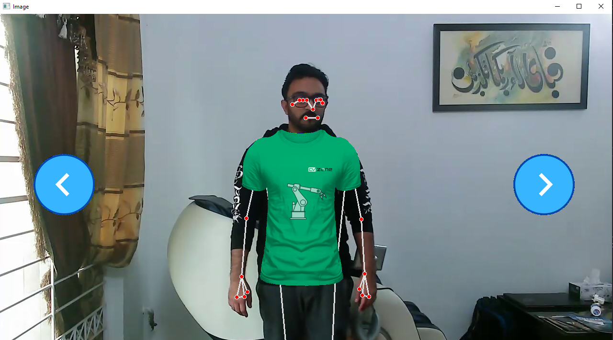
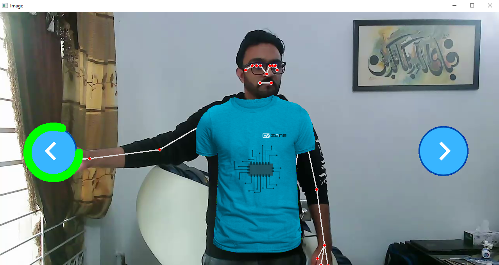

# Shirt-Try-On_OpenCV-Python

Using Posedetection of cvzone library to draw landmark on pose of person. 
  
Base on those landmarks, we over draw the Shirt image on that. 
We can touch the buttons to change another shirts 

